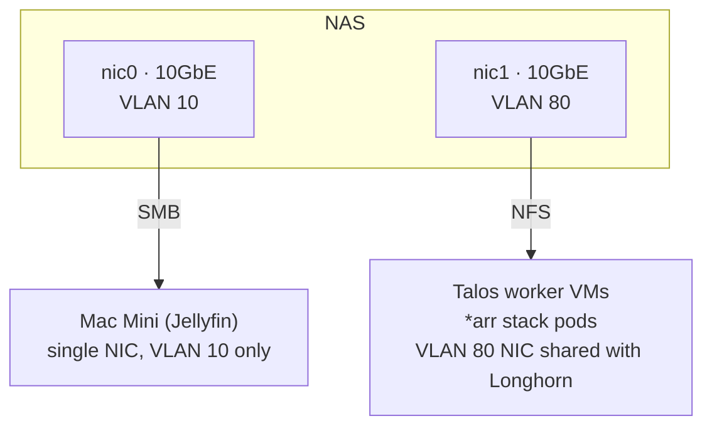
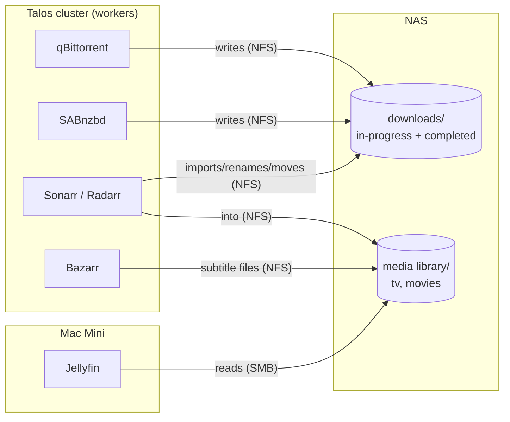
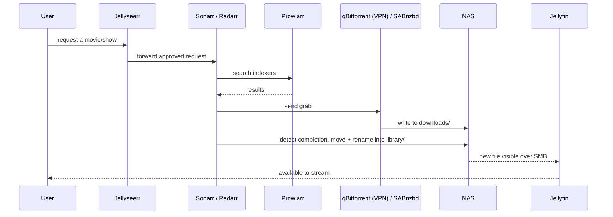

# Media Stack Architecture (target state)

This is the application layer on top of [talos.md](talos.md) — the *arr
stack and Jellyfin. Like talos.md, it's a target-state design doc: none
of this is deployed yet.

Two things run outside the Talos cluster's scope: nothing here changes
that — Jellyfin runs on a **Mac Mini**, not as a Talos workload, because
hardware-accelerated transcoding (Quick Sync on Intel, VideoToolbox on
Apple Silicon) is straightforward on bare metal and would mean GPU
passthrough into a VM otherwise. Everything else — the *arr stack, both
download clients, subtitle automation, and the request portal — runs as
regular Kubernetes workloads on Talos, GitOps-managed by the same ArgoCD
instance described in
[talos.md's Core platform applications](talos.md#core-platform-applications).

## Components

| App | Purpose | Runs on | VPN |
|-----|---------|---------|-----|
| Jellyseerr | User-facing request portal — approved requests get forwarded to Sonarr/Radarr | Talos | No |
| Sonarr | TV automation — tracks wanted episodes, searches indexers, sends grabs to a downloader, imports finished files | Talos | No |
| Radarr | Same as Sonarr, for movies | Talos | No |
| Prowlarr | Indexer manager — one place to configure trackers/indexers, pushed out to Sonarr, Radarr, and the downloaders | Talos | No |
| qBittorrent | Torrent download client | Talos | **Yes** — routed through a VPN sidecar (e.g. gluetun) using **PIA** |
| SABnzbd | Usenet download client | Talos | No — provider-based, not peer-to-peer, no swarm IP exposure |
| Bazarr | Subtitle automation — watches the Sonarr/Radarr libraries, fetches matching subtitles | Talos | No |
| Jellyfin | Media server — transcodes and streams the finished library to clients | **Mac Mini** | No |

Only qBittorrent needs a VPN: torrent swarms expose participants' IPs to
every peer, usenet doesn't. Routing just that one client's egress through
a VPN sidecar (rather than a cluster-wide VPN) keeps everything else's
networking simple.

`arr` app config (SQLite databases, settings) is small, stateful, and
needs to survive pod rescheduling — backed by a Longhorn PVC per app,
same mechanism as [talos.md's platform apps](talos.md#core-platform-applications).
The media library itself is bulk storage and lives elsewhere — see
below — not on Longhorn.

## Storage: shared NAS library

The media library (what Jellyfin serves, and what Sonarr/Radarr import
into) lives on the **NAS**, mounted by both sides — the *arr stack's
Talos worker nodes, and the Mac Mini running Jellyfin — over **two
different protocols, on two different NICs and VLANs**, not one shared
path:

- **NFS over VLAN 80**, for the Talos side (Linux) — the *arr stack pods
  run on Talos worker VMs, which already carry a second NIC on VLAN 80
  for Longhorn (see [talos.md's Storage section](talos.md#storage-longhorn-on-dedicated-per-node-ssds)).
  The NFS mount reuses that same interface rather than adding a third
  NIC, and keeps bulk media/download traffic off VLAN 10 entirely.
- **SMB over VLAN 10**, for the Mac Mini — chosen over NFS specifically
  because of past reliability issues with macOS's NFS client. The Mac
  Mini only has one NIC/one network, so VLAN 10 is its only option
  regardless of protocol.

The NAS itself has **two dedicated 10GbE NICs** to support this split —
one on VLAN 10 (serving SMB to the Mac Mini and general LAN access), one
on VLAN 80 (serving NFS to the Talos workers, and doubling as the path
for Longhorn's S3 backup target from [talos.md](talos.md#backup)). One
shared library either way, not a copy on each side — just two different
mount paths into it, on two different networks.

Same NAS already used for Longhorn's S3 backup target in
[talos.md](talos.md#backup) — this is a second, unrelated share on it
(bulk media files, not Longhorn snapshots).

### Import behavior: move, not hardlink

Sonarr/Radarr are configured to **move** completed downloads into the
library rather than hardlink them. Hardlinking is cheaper (metadata-only,
instant) but requires `downloads/` and `library/` to sit on the same
filesystem — moving avoids that constraint at the cost of an actual file
copy across the NAS's own filesystem.

qBittorrent is configured to **stop seeding and remove the torrent once
its seeding goal (ratio/time) is met**, rather than seeding indefinitely.
Combined with move-based import, this keeps `downloads/` from
accumulating completed torrents that have already been moved into the
library — without it, a torrent could keep seeding a file that no longer
needs to exist in `downloads/` at all.

## Request → playback flow

Bazarr isn't in this sequence directly — it runs on its own schedule,
watching the library for content missing subtitles rather than reacting
to each import.

## Networking

Ingress into the *arr stack's web UIs (Jellyseerr, Sonarr, Radarr,
Prowlarr, Bazarr, qBittorrent/SABnzbd UIs) reuses the same
**ingress-nginx** and cert-manager setup from
[talos.md](talos.md#core-platform-applications) — no separate ingress
layer for this app tier.

The Mac Mini running Jellyfin isn't part of the Talos/Proxmox network
design in [proxmox.md](proxmox.md) or [talos.md](talos.md) at all — it
sits on **VLAN 10**, the general management/LAN network, alongside client
devices and the Talos VMs' own management IPs — not on the
Proxmox-specific VLAN 80 storage network, and it has only the one NIC, so
it has no way onto VLAN 80 even if it needed one.

The *arr stack's NFS traffic, by contrast, rides **VLAN 80** — see
[Storage](#storage-shared-nas-library) above for why, and the NAS's
dual-NIC setup that makes it possible.

## Open questions

None outstanding — VPN provider (PIA), NAS protocols (NFS for Talos, SMB
for the Mac Mini), network placement (VLAN 10), and the import/seeding
behavior are all settled above.
