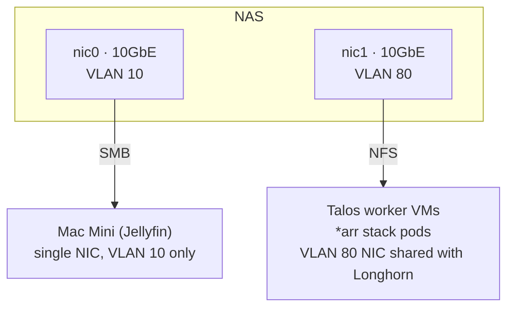
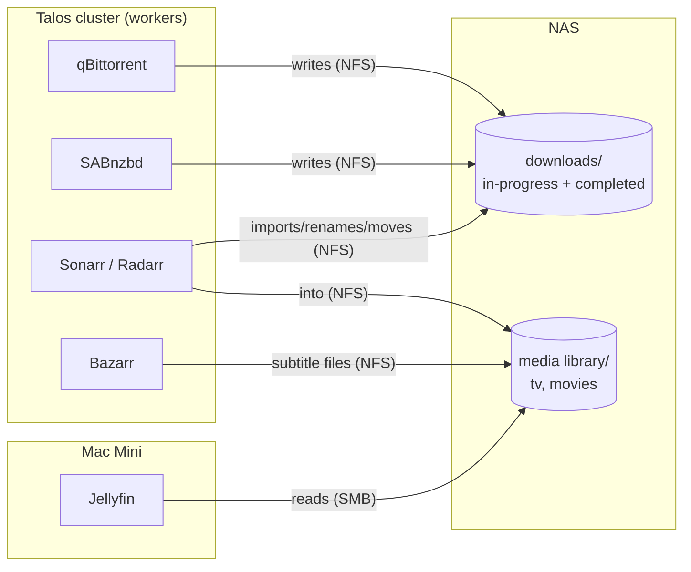
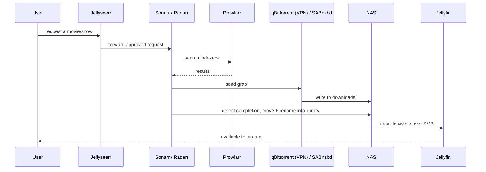

# Media Stack Architecture (target state)

This document describes the application layer on top of
[talos.md](talos.md): the *arr stack and Jellyfin. Like talos.md, this
document is a target-state design. None of this is deployed yet.

One component runs outside the Talos cluster's scope. Jellyfin runs on a
Mac Mini, not as a Talos workload. Hardware-accelerated transcoding,
Quick Sync on Intel or VideoToolbox on Apple Silicon, is straightforward
on bare metal. Running Jellyfin on Talos would otherwise mean Graphics
Processing Unit (GPU) passthrough into a VM. Everything else — the *arr
stack, both download clients, subtitle automation, and the request
portal — runs as regular Kubernetes workloads on Talos. The same ArgoCD
instance described in
[talos.md's Core platform applications](talos.md#core-platform-applications)
manages these workloads through GitOps.

## Components

| App | Purpose | Runs on | VPN |
|-----|---------|---------|-----|
| Jellyseerr | User-facing request portal — approved requests get forwarded to Sonarr/Radarr | Talos | No |
| Sonarr | TV automation — tracks wanted episodes, searches indexers, sends grabs to a downloader, imports finished files | Talos | No |
| Radarr | Same as Sonarr, for movies | Talos | No |
| Prowlarr | Indexer manager — one place to configure trackers/indexers, pushed out to Sonarr, Radarr, and the downloaders | Talos | No |
| qBittorrent | Torrent download client | Talos | **Yes** — routed through a VPN sidecar (e.g. gluetun) using **PIA** |
| SABnzbd | Usenet download client | Talos | No — provider-based, not peer-to-peer, no swarm IP exposure |
| Bazarr | Subtitle automation — watches the Sonarr/Radarr libraries, fetches matching subtitles | Talos | No |
| Jellyfin | Media server — transcodes and streams the finished library to clients | **Mac Mini** | No |

Only qBittorrent needs a Virtual Private Network (VPN). Torrent swarms
expose each participant's IP address to every peer; Usenet does not
expose IP addresses this way. Routing only that one client's egress
through a VPN sidecar, rather than a cluster-wide VPN, keeps the
networking for every other component simple.

Each *arr app's config, its SQLite databases and settings, is small and
stateful. This config must survive pod rescheduling. A Longhorn
Persistent Volume Claim (PVC) per app backs this config, the same
mechanism [talos.md's platform apps](talos.md#core-platform-applications)
use. The media library itself is bulk storage. The library lives
elsewhere, not on Longhorn — see [Storage](#storage-shared-nas-library)
below.

## Storage: shared NAS library

The media library is what Jellyfin serves, and what Sonarr and Radarr
import files into. This library lives on the Network Attached Storage
(NAS). Both sides mount the library: the *arr stack's Talos worker VMs,
and the Mac Mini running Jellyfin. Each side mounts the library over a
different protocol, on a different NIC and VLAN, not over one shared
path:

- **Network File System (NFS) over VLAN 80, for the Talos side (Linux).**
  The *arr stack pods run on Talos worker VMs, which already carry a
  second NIC on VLAN 80 for Longhorn (see
  [talos.md's Storage section](talos.md#storage-longhorn-on-dedicated-per-node-ssds)).
  The NFS mount reuses that same interface, instead of adding a third
  NIC. This choice keeps bulk media and download traffic off VLAN 10
  entirely.
- **Server Message Block (SMB) over VLAN 10, for the Mac Mini.** The
  design chose SMB over NFS specifically because of past reliability
  issues with macOS's NFS client. The Mac Mini has only one NIC and one
  network, so VLAN 10 is its only option, regardless of protocol.

The NAS itself has two dedicated 10 Gigabit Ethernet (10GbE) NICs to
support this split. One NIC serves VLAN 10, for SMB to the Mac Mini and
general Local Area Network (LAN) access. The other NIC serves VLAN 80,
for NFS to the Talos worker VMs, and doubles as the path for Longhorn's
S3 backup target from [talos.md](talos.md#backup). Both sides share one
library; neither side holds a copy. Each side has only a different mount
path into the same library, on a different network.

This library uses the same NAS already used for Longhorn's S3 backup
target in [talos.md](talos.md#backup). The media library is a second,
unrelated share on the NAS: it holds bulk media files, not Longhorn
snapshots.

### Import behavior: move, not hardlink

The Sonarr and Radarr config moves completed downloads into the library,
instead of creating a hardlink to them. A hardlink is cheaper: it only
changes metadata and completes instantly. However, a hardlink
requires `downloads/` and `library/` to sit on the same filesystem.
Moving the file avoids that constraint, at the cost of an actual file
copy across the NAS's own filesystem.

The qBittorrent config stops seeding and removes the torrent once it
meets its seeding goal (ratio or time), instead of seeding indefinitely.
Combined with move-based import, this setting keeps `downloads/` from
accumulating completed torrents that have already moved into the
library. Without this setting, a torrent could keep seeding a file that
no longer needs to exist in `downloads/` at all.

## Request → playback flow

Bazarr does not appear in this sequence directly. Bazarr runs on its own
schedule. It watches the library for content that is missing subtitles,
instead of reacting to each import.

## Networking

Ingress into the *arr stack's web User Interfaces (UIs) reuses the same
ingress-nginx and cert-manager setup from
[talos.md](talos.md#core-platform-applications). This covers Jellyseerr,
Sonarr, Radarr, Prowlarr, Bazarr, qBittorrent, and SABnzbd. This app tier
has no separate ingress layer.

The Mac Mini running Jellyfin is not part of the Talos or Proxmox network
design in [proxmox.md](proxmox.md) or [talos.md](talos.md) at all. The
Mac Mini sits on VLAN 10, the general management and LAN network,
alongside client devices and the Talos VMs' own management IP addresses.
It does not sit on the Proxmox-specific VLAN 80 storage network. The Mac
Mini has only one NIC, so it has no path onto VLAN 80, even if it needed
one.

The *arr stack's NFS traffic, by contrast, runs over VLAN 80. See
[Storage](#storage-shared-nas-library) above for the reasons, and for the
NAS's dual-NIC setup that makes it possible.

## Open questions

This document has no outstanding open questions. The VPN provider (PIA)
and the NAS protocols (NFS for Talos, SMB for the Mac Mini) are settled
above. The network placement for each component, and the import and
seeding behavior, are also settled above.
