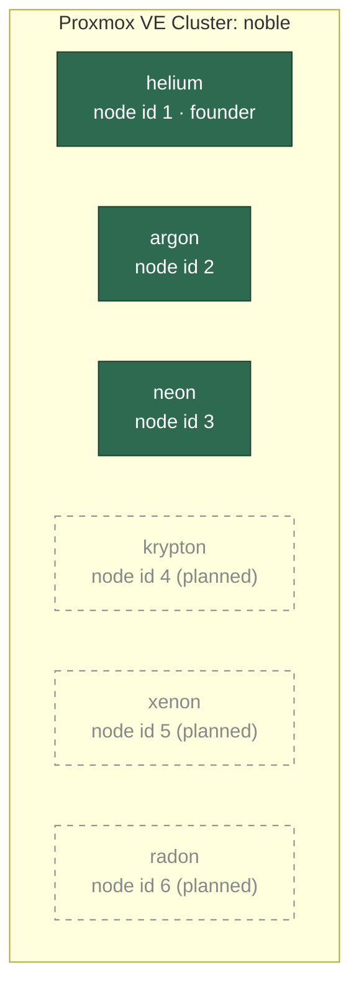
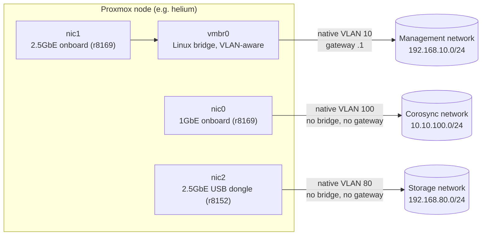
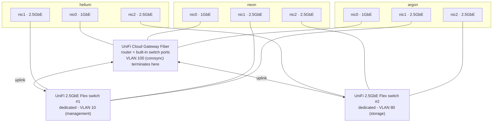
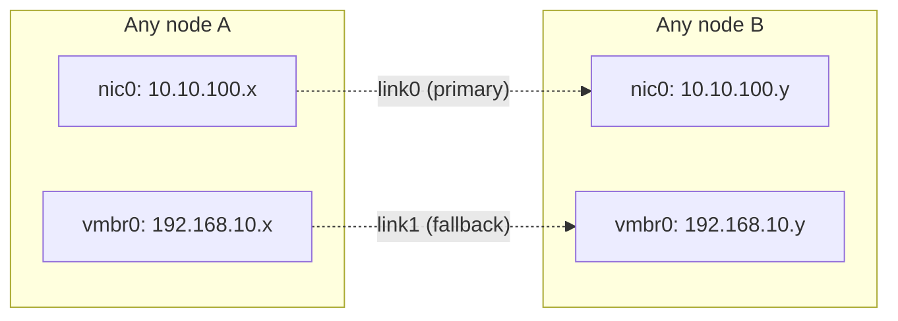
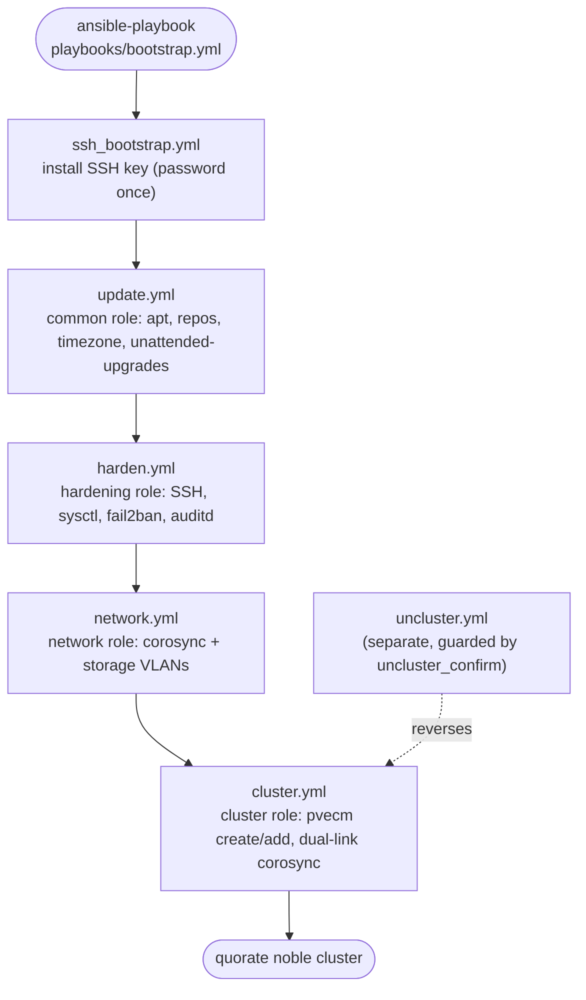
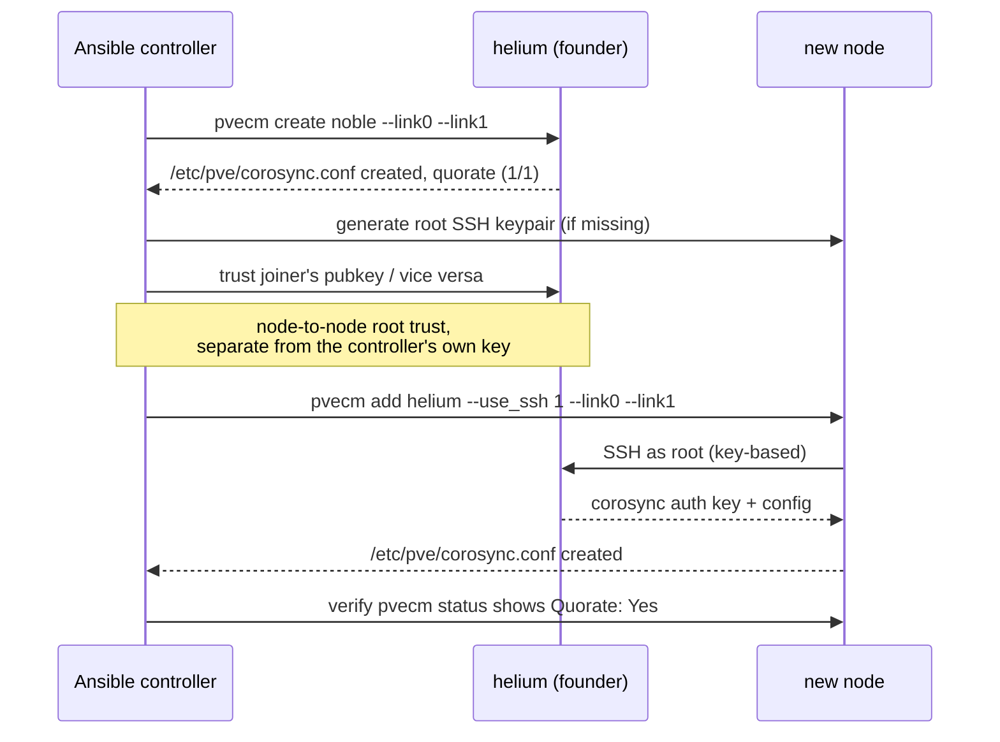

# Proxmox Cluster Architecture

The cluster name is `noble`. Node names come from noble gases, in periodic
table order. Today, 3 nodes are active. 3 more nodes are planned. The
planned nodes continue the same naming convention.

| Node | Element | Status | Management (VLAN 10) | Corosync (VLAN 100) | Storage (VLAN 80) |
|------|---------|--------|-----------------------|----------------------|--------------------|
| helium | He | active (founder) | 192.168.10.10 | 10.10.100.10 | 192.168.80.10 |
| neon | Ne | active | 192.168.10.20 | 10.10.100.20 | 192.168.80.20 |
| argon | Ar | active | 192.168.10.30 | 10.10.100.30 | 192.168.80.30 |
| krypton | Kr | planned | 192.168.10.40 | 10.10.100.40 | 192.168.80.40 |
| xenon | Xe | planned | 192.168.10.50 | 10.10.100.50 | 192.168.80.50 |
| radon | Rn | planned | 192.168.10.60 | 10.10.100.60 | 192.168.80.60 |

The planned IP addresses in the table above continue the existing
`.10` / `.20` / `.30` pattern. The repo does not reserve these IP
addresses yet. Before you provision a new node, reserve its three IP
addresses in UniFi (see
[Notable design decisions](#notable-design-decisions--lessons-learned)).
Then add matching entries to `inventory/hosts.yml` and
`inventory/host_vars/`.

## Cluster membership

The `pvecm` command assigns node IDs in join order, not by the naming
convention. Helium is node 1 because it is `groups['noble'][0]` in the
inventory. The inventory marks helium as the founder node. Argon became
node 2 and neon became node 3. This order depended only on which node's
`pvecm add` command finished first during the initial cluster formation.
The order does not follow alphabetical or periodic table order.

At 6 nodes, the `votequorum` service sets `expected_votes` and `quorum`
automatically. Currently the cluster has 3 votes and a quorum of 2.

NOTE: An even node count has a weaker quorum property than an odd node
count. In a 3-3 network partition, neither side has a majority. Both
halves lose quorum and fence their guests.

Proxmox's usual solution is a quorum device (QDevice). A QDevice is a
lightweight external tie-breaker, such as a Raspberry Pi or a small
Virtual Machine (VM) outside the cluster. A QDevice is a better solution
than a seventh full node. Plan to add a QDevice once krypton, xenon, and radon bring the
node count to 6. The current playbooks do not set up a QDevice.

## Per-node network layout

Each node has 3 physical Network Interface Cards (NICs). Each NIC connects
to one isolated network. Today, no Virtual Machine (VM) or container
traffic runs on any of these NICs. `vmbr0` on `nic1` is where VM bridges
would attach. However, the config does not define any Virtual Local Area
Network (VLAN) beyond the native management VLAN on it.

All three VLANs (10, 80, and 100) are native and untagged on their switch
ports, not 802.1Q tagged. A `tcpdump` capture on both the corosync and
storage links confirmed this (see
[Notable design decisions](#notable-design-decisions--lessons-learned)).
The config for `nic0` and `nic2` puts the IP address directly on the
interface. The config does not use `.VLAN` sub-interfaces.

## Physical switching

Each of the three networks has its own dedicated switching hardware. No
two networks share a switch. No network crosses an inter-switch link to
reach another node on the same network. All three nodes' 1 Gigabit
Ethernet (1GbE) NICs (`nic0`, corosync) plug directly into the Cloud
Gateway Fiber's own switch ports. The management network (`nic1`) has its
own Flex switch. The storage network (`nic2`) has a second, separate Flex
switch. All three devices belong to the same UniFi-managed network. This
shared network is why the live gateway and multicast Domain Name System
(mDNS) reflection occur (see
[Notable design decisions](#notable-design-decisions--lessons-learned)).
However, no network shares switching hardware with another network.

## Corosync link redundancy

The `cluster.yml` playbook configures corosync with two links per node.
With this design, a problem with the dedicated corosync NIC, VLAN, or
switch port does not cost the cluster quorum:

`link0` is the dedicated, otherwise idle corosync network. It has low
latency because no other traffic competes for it. `link1` uses the
management network as a fallback link. The management network also
carries Secure Shell (SSH), Application Programming Interface (API), and
Graphical User Interface (GUI) traffic. This is why `link1` is the
fallback link, not the primary link.

## Ansible automation pipeline

Each stage carries a tag: `ssh_bootstrap`, `update`, `harden`, `network`,
or `cluster`. These tags let `bootstrap.yml` run end-to-end on fresh
nodes. The tags also let you re-enter the playbook at a single stage, for
example with `--tags network` or `--skip-tags ssh_bootstrap`. See
`ansible/README.md` for the full command reference and the caveats for
each stage.

## Cluster formation sequence

This sequence shows what happens inside `cluster.yml` when a new node
joins the cluster:

The playbook chains `pvecm add` and `pvecm create` with a check for the
file `/etc/pve/corosync.conf` afterward. If the file does not exist, the
playbook retries the command. Both commands have exited with status `0`
while a step silently failed. The whole join play uses
`any_errors_fatal: true` and `serial: 1`. With this setting, one node's
failure halts the playbook before the next node acts against an
unconfirmed cluster state.

## Extending to 6 nodes

1. Rack and cable the new node the same way as the existing three nodes.
   Connect the 1GbE port to the corosync VLAN's switch port. Connect one
   2.5GbE port to the management VLAN. Connect the second 2.5GbE port to
   the storage VLAN.
2. Reserve its 3 IP addresses (management, corosync, and storage) in
   UniFi, outside the Dynamic Host Configuration Protocol (DHCP) range.
   Match the table at the top of this document.
3. Add the node to `inventory/hosts.yml` under the `noble` group. Create
   `inventory/host_vars/<name>.yml` with `pve_corosync_ip` and
   `pve_storage_ip`. Copy an existing host's file as a template.
4. Run `ansible-playbook playbooks/bootstrap.yml -l <name>` to bring only
   the new node through the SSH bootstrap, update, harden, and network
   stages. Then run `ansible-playbook playbooks/cluster.yml` (without
   `-l`, since this stage needs the whole group) to join the node to the
   cluster. The `cluster.yml` playbook only acts on nodes that are not
   already in the cluster, so it leaves existing nodes alone.
5. Once the cluster reaches 6 nodes, revisit the QDevice note in
   [Cluster membership](#cluster-membership).

## Notable design decisions / lessons learned

These decisions came up during the actual buildout. They shape why the
config looks the way it does. Read this section before you change the
network or cluster roles.

- **Native and untagged VLANs, not tagged trunks.** Both the corosync
  (VLAN 100) and storage (VLAN 80) switch ports send and expect untagged
  frames, not 802.1Q-tagged frames. The first attempts used tagged
  `nic0.100` and `nic2.80` sub-interfaces. These attempts failed silently:
  the interface stayed up, it received an address, but no connectivity
  worked. A `tcpdump -e` capture on the raw interface diagnosed the fault.
  Confirm the framing with `tcpdump` before you assume a switch port's
  tagging mode.
- **Shared with existing UniFi infrastructure.** The corosync and storage
  VLANs are not freshly isolated segments. Both VLANs come from an
  existing UniFi home network. Each VLAN has a live gateway (`.1`) that
  performs Internet Group Management Protocol (IGMP) and mDNS reflection.
  Both subnets turn off DHCP for the reserved node IP addresses, to avoid
  address collisions. Disable DHCP the same way on any new subnet used by
  future nodes.
- **Helium's installer gap.** The Proxmox installer creates
  `/usr/local/lib/systemd/network/50-pmx-nic{0,1,2}.link` files to pin NIC
  names to MAC addresses. Helium's installer never created the `nic2`
  entry, likely because the installer did not detect the Universal Serial
  Bus (USB) dongle at install time. The fix uses `pve_nic2_mac_override`
  in helium's host_vars file. This override deploys a matching `.link`
  file and renames the live interface immediately. Check for this gap on
  any new node before you assume `nic0`, `nic1`, and `nic2` naming is
  consistent.
- **`pvecm add` and `pvecm create` can exit with status 0 after a silent
  failure.** During the initial cluster formation, one of these commands
  returned success, but it never created `/etc/pve/corosync.conf`. Both
  commands are now chained with `&& test -f /etc/pve/corosync.conf`. The
  playbook retries based on this file check, not on the command's own
  exit code.
- **`any_errors_fatal` matters with `serial: 1`.** Without
  `any_errors_fatal`, a failure on one node in a serial batch does not
  stop Ansible from moving on to the next node. This gap caused the
  initial cluster join to end up with two nodes attempting to join
  against an unconfirmed cluster state. Both `cluster.yml` and
  `uncluster.yml` set `any_errors_fatal`.
