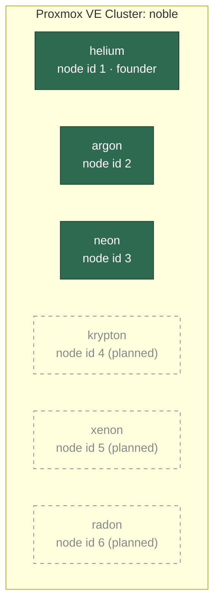
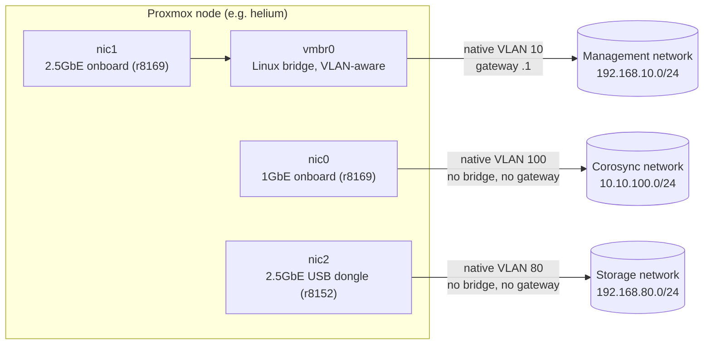
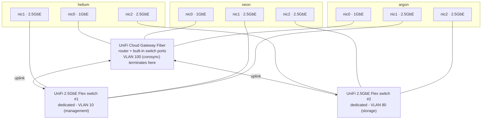
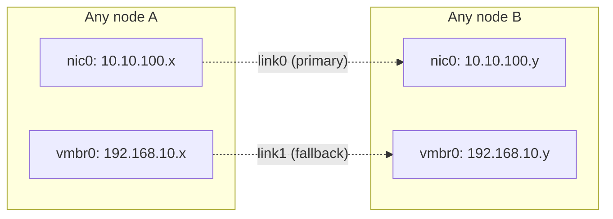
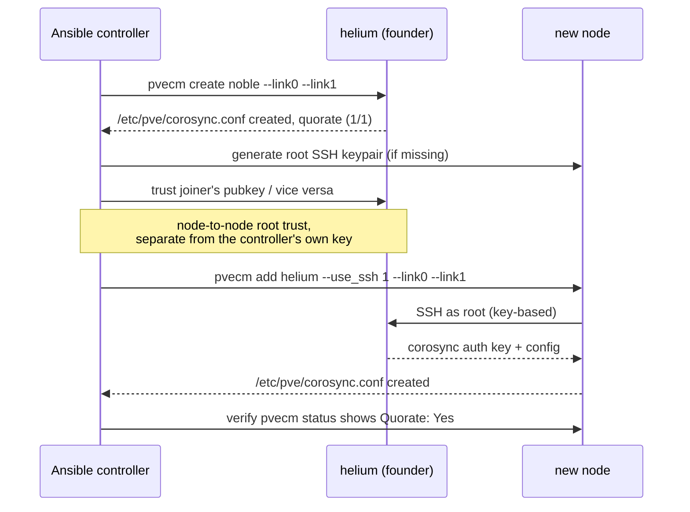

# Proxmox Cluster Architecture

Cluster name: **`noble`** — nodes are named after noble gases, in periodic
table order. 3 nodes are active today; 3 more are planned, continuing the
naming convention.

| Node | Element | Status | Management (VLAN 10) | Corosync (VLAN 100) | Storage (VLAN 80) |
|------|---------|--------|-----------------------|----------------------|--------------------|
| helium | He | active (founder) | 192.168.10.10 | 10.10.100.10 | 192.168.80.10 |
| neon | Ne | active | 192.168.10.20 | 10.10.100.20 | 192.168.80.20 |
| argon | Ar | active | 192.168.10.30 | 10.10.100.30 | 192.168.80.30 |
| krypton | Kr | planned | 192.168.10.40 | 10.10.100.40 | 192.168.80.40 |
| xenon | Xe | planned | 192.168.10.50 | 10.10.100.50 | 192.168.80.50 |
| radon | Rn | planned | 192.168.10.60 | 10.10.100.60 | 192.168.80.60 |

The "planned" IPs above just continue the existing `.10 / .20 / .30 / ...`
pattern - they aren't reserved anywhere yet. Before provisioning a new
node, reserve its three IPs in UniFi (see
[Notable design decisions](#notable-design-decisions--lessons-learned))
and add matching entries to `inventory/hosts.yml` and
`inventory/host_vars/`.

## Cluster membership

Node IDs are assigned by `pvecm` in join order, not by naming convention -
helium is node 1 because it's `groups['noble'][0]` in the inventory (the
founder); argon ended up 2 and neon 3 purely because of which node's
`pvecm add` happened to complete first during the initial cluster
formation, not alphabetical or periodic-table order.

At 6 nodes, `votequorum` sets `expected_votes` and `quorum` automatically
(currently 3 votes / quorum 2). **Worth planning for:** an even node count
has a weaker quorum property than odd - a 3-3 network partition has no
majority on either side, so both halves lose quorum and fence their guests.
Proxmox's usual mitigation is a **QDevice** (a lightweight external
tie-breaker, e.g. a Raspberry Pi or small VM outside the cluster) rather
than a 7th full node - worth adding once krypton/xenon/radon bring the
count to 6, not something the current playbooks set up.

## Per-node network layout

Each node has 3 physical NICs, each dedicated to one isolated network - no
VM/CT traffic runs on any of them today (`vmbr0` on `nic1` is where VM
bridges would attach, but no VLANs beyond the native management one are
currently defined on it).

All three VLANs (10, 80, 100) turned out to be **native/untagged** on their
respective switch ports, not 802.1Q tagged - confirmed with `tcpdump` for
both the corosync and storage links (see
[Notable design decisions](#notable-design-decisions--lessons-learned)).
Config for `nic0`/`nic2` puts the IP directly on the interface; no `.VLAN`
sub-interfaces are used.

## Physical switching

Each of the three networks has fully dedicated switching hardware - no two
networks share a switch, and none of them cross an inter-switch link to
reach another node on the same network. All three nodes' 1GbE NICs
(`nic0`, corosync) plug directly into the Cloud Gateway Fiber's own switch
ports; management (`nic1`) has its own Flex switch, storage (`nic2`) has a
second, separate Flex switch. All three devices are part of the same
UniFi-managed network (hence the live gateway/mDNS reflection noted
below), but no switching hardware is shared between networks.

## Corosync link redundancy

`cluster.yml` configures corosync with two links per node, so a problem
with the dedicated corosync NIC/VLAN/switch port doesn't cost quorum:

`link0` is the dedicated, otherwise-idle corosync network - low latency,
nothing else competing for it. `link1` piggybacks on the management
network as a fallback; it's shared with SSH/API/GUI traffic, which is why
it's the fallback and not the primary.

## Ansible automation pipeline

Each stage is tagged (`ssh_bootstrap`, `update`, `harden`, `network`,
`cluster`) so `bootstrap.yml` can run end-to-end on fresh nodes, or be
re-entered at any single stage (`--tags network`, `--skip-tags
ssh_bootstrap`, etc). See `ansible/README.md` for the full command
reference and per-stage caveats.

## Cluster formation sequence

What happens inside `cluster.yml` when a new node joins:

`pvecm add`/`pvecm create` are chained with a check that
`/etc/pve/corosync.conf` actually exists afterward and retried if not -
both have been observed to exit `0` while silently failing a step. The
whole join play uses `any_errors_fatal: true` and `serial: 1`, so one
node's failure halts before the next node attempts anything against
unconfirmed cluster state.

## Extending to 6 nodes

1. Rack/cable the new node the same way as the existing three: 1GbE onto
   the corosync VLAN's switch port, one 2.5GbE onto the management VLAN,
   the second 2.5GbE onto the storage VLAN.
2. Reserve its 3 IPs (management/corosync/storage) in UniFi, outside DHCP
   range, matching the table at the top of this doc.
3. Add it to `inventory/hosts.yml` under the `noble` group, and create
   `inventory/host_vars/<name>.yml` with `pve_corosync_ip` and
   `pve_storage_ip` (copy an existing host's file as a template).
4. Run `ansible-playbook playbooks/bootstrap.yml -l <name>` to bring just
   the new node through SSH bootstrap → update → harden → network, then
   `ansible-playbook playbooks/cluster.yml` (no `-l`, needs the whole
   group) to join it - `cluster.yml` only acts on nodes that aren't
   already in the cluster, so existing nodes are left alone.
5. Once at 6 nodes, revisit the QDevice note above.

## Notable design decisions / lessons learned

These came up during the actual buildout and shape why the config looks
the way it does - worth reading before changing the network or cluster
roles.

- **Native/untagged VLANs, not tagged trunks.** Both the corosync (VLAN
  100) and storage (VLAN 80) switch ports turned out to send/expect
  untagged frames, not 802.1Q-tagged ones. First attempts used tagged
  `nic0.100`/`nic2.80` sub-interfaces and silently failed (interface up,
  address assigned, zero connectivity) until diagnosed with `tcpdump -e`
  on the raw interface. Confirm framing with `tcpdump` before assuming a
  switch port's tagging mode.
- **Shared with existing UniFi infrastructure.** The corosync and storage
  VLANs aren't freshly isolated segments - they're carved out of an
  existing UniFi home network, each with a live gateway (`.1`) doing
  IGMP/mDNS reflection. DHCP was disabled on both subnets for the reserved
  node IPs to avoid collisions; the same needs doing for any new subnet
  used by future nodes.
- **`helium`'s installer gap.** The Proxmox installer creates
  `/usr/local/lib/systemd/network/50-pmx-nic{0,1,2}.link` files to pin NIC
  names by MAC address. helium's installer never created the `nic2` entry
  (likely the USB dongle wasn't detected at install time) - fixed via
  `pve_nic2_mac_override` in its host_vars, which deploys a matching
  `.link` file and renames the live interface immediately. Worth checking
  for on any new node before assuming `nic0`/`nic1`/`nic2` naming is
  consistent.
- **`pvecm add`/`create` can exit 0 having silently failed.** Observed
  directly during initial cluster formation: the command returned success
  but `/etc/pve/corosync.conf` was never created. Both commands are now
  chained with `&& test -f /etc/pve/corosync.conf` and retried on that,
  not on the command's own exit code.
- **`any_errors_fatal` matters with `serial: 1`.** Without it, a failure
  on one node in a serial batch doesn't stop Ansible from moving on to the
  next node - which is how the initial cluster join ended up with two
  nodes attempting to join against an unconfirmed cluster state. Both
  `cluster.yml` and `uncluster.yml` set it.
