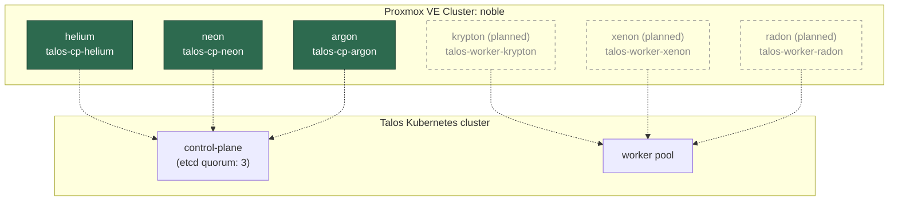
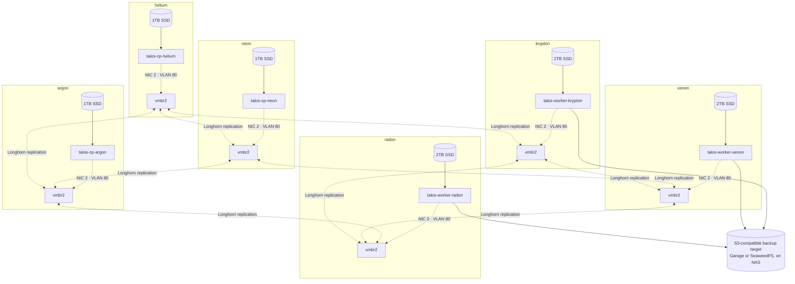
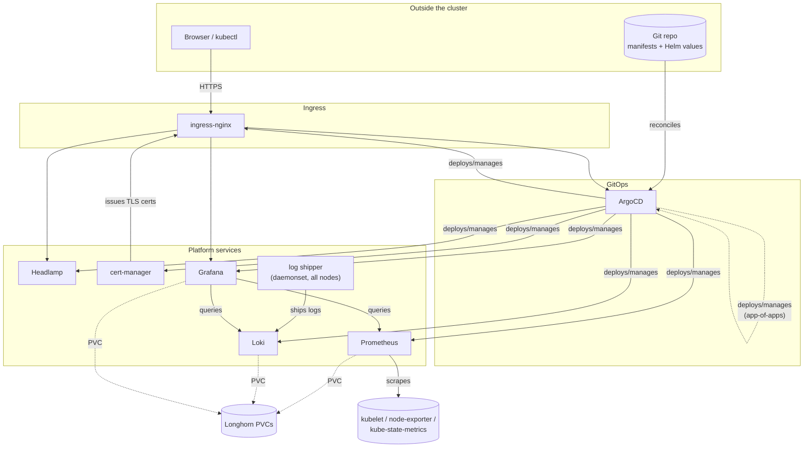

# Talos Kubernetes Architecture (target state)

Unlike [proxmox.md](proxmox.md), which documents an already-built cluster,
this document describes the target state for a Talos Linux Kubernetes
cluster. This cluster runs as Virtual Machines (VMs) on top of the
`noble` Proxmox cluster. Nothing here is deployed yet. The repo has no
`ansible/roles` directory or playbook for Talos yet. This document exists
to pin down the design before that work starts.

The design uses Talos instead of a general-purpose Linux distribution
because Talos is Application Programming Interface (API)-managed and
immutable. Talos has no SSH access and no package manager. The config
applies as a single declarative machine config. This approach fits well
on top of Proxmox VMs, which are themselves fully Ansible-managed. Both
layers are declarative. Neither layer needs hand administration.

## Cluster topology

| VM | Role | Proxmox host | vCPU | RAM | Boot disk | Longhorn SSD | Mgmt IP (VLAN 10) | Storage IP (VLAN 80) |
|----|------|---------------|------|-----|-----------|----------------|---------------------|------------------------|
| talos-cp-helium | control-plane | helium | 5 | 14 GiB | 64 GiB | 1 TB | 192.168.10.101 | 192.168.80.101 |
| talos-cp-neon | control-plane | neon | 5 | 14 GiB | 64 GiB | 1 TB | 192.168.10.102 | 192.168.80.102 |
| talos-cp-argon | control-plane | argon | 5 | 14 GiB | 64 GiB | 1 TB | 192.168.10.103 | 192.168.80.103 |
| talos-worker-krypton | worker | krypton (planned) | 8 | 16 GiB | 32 GiB | 2 TB | 192.168.10.104 | 192.168.80.104 |
| talos-worker-xenon | worker | xenon (planned) | 8 | 16 GiB | 32 GiB | 2 TB | 192.168.10.105 | 192.168.80.105 |
| talos-worker-radon | worker | radon (planned) | 8 | 16 GiB | 32 GiB | 2 TB | 192.168.10.106 | 192.168.80.106 |

All six VMs carry a second Network Interface Card (NIC) on VLAN 80 and a
dedicated Longhorn Solid State Drive (SSD). Control-plane nodes get a
smaller 1 TB disk because the design expects them to carry less volume
traffic than the workers. Control-plane nodes still contribute to the
Longhorn storage pool; they do not sit outside it. Each storage IP
address mirrors the last octet of its management IP address, the same
convention [proxmox.md](proxmox.md) uses across its own VLANs.

The design places one control-plane VM on each existing Proxmox node
(helium, neon, and argon). It places one worker VM on each planned node
(krypton, xenon, and radon). See [Phased rollout](#phased-rollout) for
why control-plane and worker roles land on different node generations,
instead of one of each role on all six nodes.

The range `.101` through `.106` continues past the node management IP
addresses (`.10`, `.20`, `.30`, `.40`, `.50`, `.60`) from
[proxmox.md](proxmox.md). This range keeps VM and hypervisor addresses
from colliding. Like those node IP addresses, the repo does not reserve
these VM IP addresses in UniFi yet. Reserve them, outside the Dynamic
Host Configuration Protocol (DHCP) range, before you provision the first
VM.

The virtual CPU (vCPU) and Random Access Memory (RAM) values above are
starting points, not measured sizing. Revisit these values once real
workloads are running.

Three control-plane nodes give etcd a quorum of 2 out of 3. One node can
be down for patching, a reboot, or a failure, without the cluster losing
the ability to schedule work or accept API writes. This reasoning mirrors
the quorum reasoning in
[proxmox.md's cluster membership section](proxmox.md#cluster-membership),
which describes the Proxmox cluster underneath.

## Networking

Talos VMs sit on the existing VLAN 10 (management) network, through each
node's `vmbr0`, rather than on a new dedicated VLAN. This choice is
consistent with
[proxmox.md's per-node network layout](proxmox.md#per-node-network-layout),
which already identifies `vmbr0` as the attachment point for VM traffic.
This choice also avoids new switch and UniFi config to stand up the
cluster.

CAUTION: Cluster and pod-facing traffic shares a broadcast domain with
Proxmox's own management, API, and Graphical User Interface (GUI)
traffic. This broadcast domain also carries the `link1` corosync fallback
link (see [proxmox.md](proxmox.md#corosync-link-redundancy)). If
Kubernetes east-west or ingress traffic grows enough to matter, revisit a
dedicated VLAN at that time. Do not pre-isolate the traffic for a load
that does not exist yet.

`talosctl` and `kubectl` access, and the Kubernetes API endpoint, all
live on this same VLAN 10 range. Every VM also carries a second NIC on
VLAN 80 for Longhorn traffic. See
[Storage](#storage-longhorn-on-dedicated-per-node-ssds).

## Storage: Longhorn on dedicated per-node SSDs

Kubernetes persistent storage uses Longhorn, replicated across all six
VMs. This includes the control-plane nodes, not just the three workers.
Replication runs over the existing VLAN 80 storage network from
[proxmox.md](proxmox.md), instead of sharing VLAN 10 with management,
API, and pod traffic. Replication and rebuild traffic can be bursty.
Keeping this traffic off the Kubernetes API and etcd link avoids storage
input/output (I/O) contention with cluster control traffic.

Every node gets a dedicated SSD, separate from the Proxmox boot /
local-lvm disk and the 32 GiB Talos boot disk. Longhorn receives this
whole SSD: 1 TB on helium, neon, and argon (control plane), and 2 TB on
krypton, xenon, and radon (workers). The sizes differ because the design
expects workers to carry more volume traffic, but both sizes contribute
to the same pool. Every VM also gets a second NIC, carrying its VLAN 80
storage IP address from the [topology table](#cluster-topology) above.
The Longhorn config uses that interface for replica-to-replica traffic.

This design requires a change to the Proxmox-side network layout, not
only a Talos-side one.
[Proxmox.md's per-node network layout](proxmox.md#per-node-network-layout)
has `nic2` (VLAN 80) as a raw interface with an IP address directly on
it, with no bridge. Because of this, nothing today lets a VM's tap
interface reach that network. All six nodes need a new `vmbr2` bridge on
`nic2`. This bridge must also carry the hypervisor's own storage IP
address, the same pattern used for `vmbr0` on VLAN 10. This change
applies to helium, neon, and argon too, not only the planned nodes,
because control-plane VMs are in the storage pool as well.

Backup traffic to the Network Attached Storage (NAS) runs over the same
VLAN 80 NIC. The S3 target is storage infrastructure, so it belongs on
the storage network, not back out over VLAN 10.

With six nodes contributing storage instead of three, Longhorn's default
3-way replication has real placement flexibility. A replica set does not
have to land on every node. So, losing one node no longer drops every
volume to 2 out of 3 replicas, the way a strict 3-node, 3-replica pool
would. Because control-plane nodes carry storage, the design can no
longer treat them as pure API and etcd machines. See the tainting note in
[Open questions](#open-questions).

The design has not decided yet how each SSD reaches its VM. The options
are Peripheral Component Interconnect Express (PCIe) passthrough, or a
Proxmox-managed disk on a dedicated per-node storage pool. Passthrough is
simpler to reason about for Longhorn, because it gives a raw device with
no virtualization overhead. However, passthrough pins that VM to its
physical node and rules out live migration. Decide this question before
you build the first VM. A change after Longhorn has data on the disk is
disruptive.

### Backup

Longhorn backs up to an S3-compatible target on the NAS. Either Garage or
SeaweedFS fronts the NAS's storage for this target; the design has not
chosen between the two yet. This backup uses Longhorn's built-in
backup-target mechanism, not a separate backup pipeline. Snapshots ship
directly from each replica to the S3 endpoint.

## Core platform applications

Everything in this section is a regular Kubernetes workload, not a fixed
VM. The Kubernetes scheduler places these pods across whichever
control-plane or worker nodes have capacity, unlike the per-VM tables
further up. This section describes the "what runs on the cluster" layer.
This layer sits on top of the VM, network, and storage target state
described above.

| App | Purpose | Ingress-exposed | Longhorn PVC |
|-----|---------|------------------|-----------------|
| ArgoCD | GitOps continuous delivery — reconciles cluster state from a git repo, and manages every other app in this table (including itself, via the app-of-apps pattern) | Yes (UI) | No — state lives in etcd + git |
| Headlamp | Web-based Kubernetes dashboard for ad-hoc inspection/debugging, RBAC-scoped | Yes (UI) | No |
| ingress-nginx | Ingress controller — terminates TLS (via cert-manager certs) and routes HTTP(S) to in-cluster UIs | n/a — it *is* the entry point | No |
| cert-manager | Issues and renews TLS certificates used by ingress-nginx | No (no UI) | No |
| Prometheus | Scrapes and stores cluster + workload metrics | Optional (usually queried via Grafana instead) | Yes |
| Loki | Aggregates logs shipped from a per-node collector | No (queried via Grafana) | Yes |
| Grafana | Dashboards querying Prometheus (metrics) and Loki (logs) | Yes (UI) | Yes — dashboard/config state |

ArgoCD is the root of the dependency graph. An operator bootstraps ArgoCD
once by hand, because no GitOps method can deploy the first GitOps
controller. From then on, ArgoCD manages every other app in the table
above declaratively from the git repository, including its own
configuration. Add or change everything below ArgoCD in the diagram
through git, not through a manual `kubectl apply` command.

## Phased rollout

1. **Control plane only, on today's 3 nodes.** Install the 1 TB Longhorn
   SSD and bridge `nic2` into `vmbr2` on helium, neon, and argon. Then
   bring up `talos-cp-helium`, `talos-cp-neon`, and `talos-cp-argon` with
   their second NIC on VLAN 80. Deploy Longhorn against just these three
   SSDs, to validate the storage path early. No dedicated worker nodes
   exist yet, so leave the control-plane nodes untainted for now. This
   keeps the cluster usable before phase 2. Re-taint the control-plane
   nodes once real workers join (see [Open questions](#open-questions) for
   how to keep Longhorn scheduling there afterward).
2. **Extend Proxmox to krypton, xenon, and radon**, following
   [proxmox.md's "Extending to 6 nodes"](proxmox.md#extending-to-6-nodes).
   This step must happen at the Proxmox layer first, regardless of Talos.
3. **Install the dedicated 2 TB SSD** in each new node before you build
   its worker VM, and decide the passthrough-versus-pool question from
   [Storage](#storage-longhorn-on-dedicated-per-node-ssds). Installing the
   SSD after the VM exists means migrating Longhorn data. Also bridge
   `nic2` into `vmbr2` on krypton, xenon, and radon, the same as phase 1.
4. **Join `talos-worker-krypton`, `talos-worker-xenon`, and
   `talos-worker-radon`** as workers, with their second NIC on VLAN 80.
   Re-taint the control-plane nodes and expand Longhorn across all six
   SSDs.
5. **Point Longhorn's backup target at the NAS** once Garage or SeaweedFS
   is running there.
6. **Bootstrap ArgoCD by hand** against the running cluster. Then hand it
   the git repository containing manifests for cert-manager,
   ingress-nginx, Prometheus, Loki, Grafana, and Headlamp, plus ArgoCD's
   own app-of-apps config. ArgoCD then takes over managing all of them —
   see [Core platform applications](#core-platform-applications).

## Open questions

This document deliberately leaves these decisions open, rather than
guessing at an answer. Resolve each one before its corresponding rollout
phase, not before you write this document:

- **Disk passthrough versus a Proxmox-managed pool** for the per-node
  Longhorn SSDs. This choice affects live migration; see
  [Storage](#storage-longhorn-on-dedicated-per-node-ssds).
- **Longhorn scheduling on tainted control-plane nodes.** Once workers
  join and control-plane VMs are re-tainted against general workloads,
  Longhorn's manager and engine components still need to run there to
  keep those 1 TB SSDs contributing to the pool. This need requires a
  toleration carve-out for Longhorn's daemonset specifically, not a
  blanket untaint.
- **Garage versus SeaweedFS** for the NAS-side S3 backup target.
- **Container Network Interface (CNI).** Talos defaults to Flannel. The
  design has not decided yet whether to keep the default or move to
  Cilium.
- **Talos and Kubernetes version pinning.** Not yet chosen.
- **Provisioning tooling.** Whether Talos VM creation and config gets its
  own Ansible role, matching the
  [proxmox.md automation pipeline](proxmox.md#ansible-automation-pipeline),
  or `talosctl` and Terraform drive it directly.
- **VLAN 10 versus a dedicated VLAN** for cluster traffic. Currently VLAN
  10 is the choice (see [Networking](#networking)). Revisit this choice
  if traffic volume or isolation needs change.
- **ingress-nginx versus Traefik** for the ingress controller. The design
  has not chosen between the two yet (see
  [Core platform applications](#core-platform-applications)).
- **cert-manager issuer strategy.** An internal, self-signed Certificate
  Authority (CA) is the natural fit for these certificates. The User
  Interfaces (UIs) for ArgoCD, Headlamp, and Grafana sit on the internal
  VLAN 10 network, not on the internet. Because of this, plain HTTP-01
  Automatic Certificate Management Environment (ACME) challenges against
  a public CA like Let's Encrypt do not work. A Domain Name System
  (DNS)-01 challenge, with a supporting DNS provider, is the only
  alternative. Not yet decided.
- **Log shipper.** Loki needs a per-node collector, such as Promtail or
  Grafana Alloy, to feed it. Not yet chosen.
