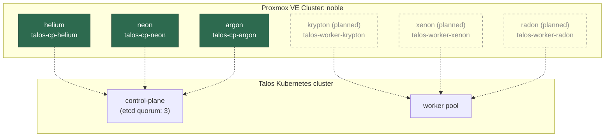
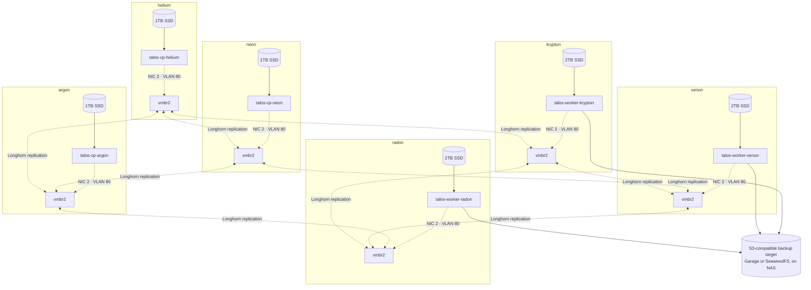
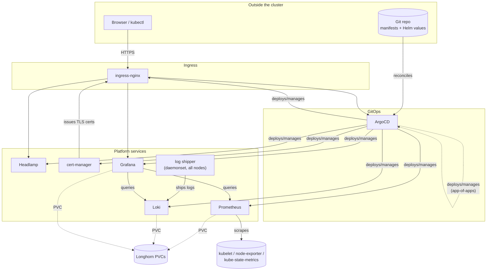

# Talos Kubernetes Architecture (target state)

Unlike [proxmox.md](proxmox.md), which documents an already-built cluster,
this describes the **target state** for a Talos Linux Kubernetes cluster
running as VMs on top of the `noble` Proxmox cluster. Nothing here is
deployed yet — there's no `ansible/roles` or playbook for Talos in this
repo yet; this doc exists to pin down the design before that work starts.

Talos is used instead of a general-purpose distro because it's
API-managed and immutable — no SSH, no package manager, config applied as
a single declarative machine config. That fits well on top of Proxmox VMs
that are themselves fully Ansible-managed: both layers are declarative,
neither is hand-administered.

## Cluster topology

| VM | Role | Proxmox host | vCPU | RAM | Boot disk | Longhorn SSD | Mgmt IP (VLAN 10) | Storage IP (VLAN 80) |
|----|------|---------------|------|-----|-----------|----------------|---------------------|------------------------|
| talos-cp-helium | control-plane | helium | 5 | 14 GiB | 64 GiB | 1 TB | 192.168.10.101 | 192.168.80.101 |
| talos-cp-neon | control-plane | neon | 5 | 14 GiB | 64 GiB | 1 TB | 192.168.10.102 | 192.168.80.102 |
| talos-cp-argon | control-plane | argon | 5 | 14 GiB | 64 GiB | 1 TB | 192.168.10.103 | 192.168.80.103 |
| talos-worker-krypton | worker | krypton (planned) | 8 | 16 GiB | 32 GiB | 2 TB | 192.168.10.104 | 192.168.80.104 |
| talos-worker-xenon | worker | xenon (planned) | 8 | 16 GiB | 32 GiB | 2 TB | 192.168.10.105 | 192.168.80.105 |
| talos-worker-radon | worker | radon (planned) | 8 | 16 GiB | 32 GiB | 2 TB | 192.168.10.106 | 192.168.80.106 |

All six VMs carry a second NIC on VLAN 80 and a dedicated Longhorn
SSD — control-plane nodes get a smaller 1 TB disk since they're expected
to carry less volume traffic than the workers, but they still contribute
to the Longhorn storage pool rather than sitting out of it. Storage IPs
mirror the management column's last octet, matching the same-last-octet
convention [proxmox.md](proxmox.md) uses across its own VLANs.

One control-plane VM per existing Proxmox node (helium/neon/argon), one
worker VM per planned node (krypton/xenon/radon) — see
[Phased rollout](#phased-rollout) for why control-plane and worker land on
different node generations rather than one-of-each on all six.

`.101`–`.106` continues past the node management IPs
(`.10`/`.20`/`.30`/`.40`/`.50`/`.60`) from [proxmox.md](proxmox.md) so VM
and hypervisor addresses never collide. Like those node IPs, these aren't
reserved in UniFi yet — do that (outside DHCP range) before provisioning
the first VM.

vCPU/RAM above are starting points, not measured sizing — revisit once
real workloads are running.

Three control-plane nodes gives etcd quorum of 2/3 — one node can be
down (patched, rebooted, failed) without losing the ability to schedule
or accept API writes. This mirrors the quorum reasoning in
[proxmox.md's cluster membership section](proxmox.md#cluster-membership),
one layer up.

## Networking

Talos VMs sit on the existing **VLAN 10 (management)** network via each
node's `vmbr0`, rather than a new dedicated VLAN. That's consistent with
[proxmox.md's per-node network layout](proxmox.md#per-node-network-layout),
which already notes `vmbr0` as where VM traffic would attach, and avoids
new switch/UniFi config to stand the cluster up.

Trade-off worth remembering: cluster and pod-facing traffic shares a
broadcast domain with Proxmox's own management/API/GUI traffic (and
`link1` corosync fallback — see
[proxmox.md](proxmox.md#corosync-link-redundancy)). If Kubernetes
east-west or ingress traffic grows enough to matter, revisit a dedicated
VLAN then rather than pre-isolating for a load that doesn't exist yet.

talosctl/kubectl access, and the Kubernetes API endpoint, both live on
this same VLAN 10 range. Every VM also carries a second NIC on VLAN 80
for Longhorn traffic — see [Storage](#storage-longhorn-on-dedicated-per-node-ssds).

## Storage: Longhorn on dedicated per-node SSDs

Kubernetes persistent storage is Longhorn, replicated across **all six
VMs** — control plane included, not just the three workers — over the
existing **VLAN 80 storage network** from [proxmox.md](proxmox.md) rather
than sharing VLAN 10 with mgmt/API/pod traffic. Replication and rebuild
traffic can be bursty, and keeping it off the same link as the Kubernetes
API/etcd avoids storage I/O contending with cluster control traffic.

Every node gets a dedicated SSD, separate from the Proxmox boot/local-lvm
disk and the 32 GiB Talos boot disk, given entirely to Longhorn: **1 TB**
on helium/neon/argon (control plane), **2 TB** on krypton/xenon/radon
(workers) — sizes differ because workers are expected to carry more
volume traffic, but both contribute to the same pool. Every VM also gets
a **second NIC**, carrying its VLAN 80 storage IP from the
[topology table](#cluster-topology) above, and Longhorn is configured to
use that interface for replica-to-replica traffic.

This requires a change to the Proxmox-side network layout, not just a
Talos-side one: [proxmox.md's per-node network layout](proxmox.md#per-node-network-layout)
has `nic2` (VLAN 80) as a raw interface with an IP directly on it — no
bridge, so nothing today lets a VM's tap interface reach that network.
**All six nodes** need a `vmbr2` bridge added on `nic2` (with the
hypervisor's own storage IP moved onto the bridge, same pattern as
`vmbr0`/VLAN 10) before their VMs can get a second NIC on VLAN 80 — this
now applies to helium/neon/argon too, not just the planned nodes, since
control-plane VMs are in the storage pool as well.

Backup traffic to the NAS runs over the same VLAN 80 NIC — the S3 target
is storage infrastructure, so it belongs on the storage network rather
than punching back out over VLAN 10.

With six nodes contributing storage instead of three, Longhorn's default
3-way replication has real placement flexibility — a replica set doesn't
have to land on every node, so losing one node no longer drops *every*
volume to 2/3 replicas the way a strict 3-node/3-replica pool would.
Control-plane nodes carrying storage also means they can't be treated as
pure API/etcd boxes anymore — see the tainting note in
[Open questions](#open-questions).

Whether each SSD reaches its VM via PCIe passthrough or as a
Proxmox-managed disk on a dedicated per-node storage pool isn't decided
yet — passthrough is simpler to reason about for Longhorn (raw device,
no virtualization overhead) but it pins that VM to its physical node and
rules out live migration. Decide this before the first VM is built, since
it's disruptive to change after Longhorn has data on it.

### Backup

Longhorn backs up to an S3-compatible target on the NAS, via either
**Garage** or **SeaweedFS** (not yet chosen between the two) fronting the
NAS's storage. This is Longhorn's built-in backup-target mechanism, not a
separate backup pipeline — snapshots ship straight from each replica to
the S3 endpoint.

## Core platform applications

Everything in this section is a regular Kubernetes workload, not a fixed
VM — the scheduler places these pods across whatever control-plane or
worker nodes have capacity, unlike the per-VM tables further up. This is
the "what runs on the cluster" layer, sitting on top of the VM, network,
and storage target state described above.

| App | Purpose | Ingress-exposed | Longhorn PVC |
|-----|---------|------------------|-----------------|
| ArgoCD | GitOps continuous delivery — reconciles cluster state from a git repo, and manages every other app in this table (including itself, via the app-of-apps pattern) | Yes (UI) | No — state lives in etcd + git |
| Headlamp | Web-based Kubernetes dashboard for ad-hoc inspection/debugging, RBAC-scoped | Yes (UI) | No |
| ingress-nginx | Ingress controller — terminates TLS (via cert-manager certs) and routes HTTP(S) to in-cluster UIs | n/a — it *is* the entry point | No |
| cert-manager | Issues and renews TLS certificates used by ingress-nginx | No (no UI) | No |
| Prometheus | Scrapes and stores cluster + workload metrics | Optional (usually queried via Grafana instead) | Yes |
| Loki | Aggregates logs shipped from a per-node collector | No (queried via Grafana) | Yes |
| Grafana | Dashboards querying Prometheus (metrics) and Loki (logs) | Yes (UI) | Yes — dashboard/config state |

ArgoCD is the root of the dependency graph: it's bootstrapped once by
hand (there's no GitOps way to deploy the first GitOps controller), and
from then on manages every other app in the table above declaratively
from the git repo, including its own configuration. Everything below it
in the diagram is expected to be added/changed via git, not `kubectl
apply` by hand.

## Phased rollout

1. **Control plane only, on today's 3 nodes.** Install the 1 TB Longhorn
   SSD and bridge `nic2` into `vmbr2` on helium/neon/argon, then bring up
   `talos-cp-helium/neon/argon` with their second NIC on VLAN 80. Deploy
   Longhorn against just these three SSDs to validate the storage path
   early. Since no dedicated worker nodes exist yet, control-plane nodes
   are left untainted temporarily so the cluster is usable before phase
   2 — re-taint them once real workers join (see
   [Open questions](#open-questions) on keeping Longhorn scheduling
   there afterward).
2. **Extend Proxmox to krypton/xenon/radon**, following
   [proxmox.md's "Extending to 6 nodes"](proxmox.md#extending-to-6-nodes) —
   this has to happen at the Proxmox layer first regardless of Talos.
3. **Install the dedicated 2 TB SSD** in each new node before building its
   worker VM, and decide the passthrough-vs-pool question above — doing
   this after the VM exists means migrating Longhorn data. Also bridge
   `nic2` into `vmbr2` on krypton/xenon/radon, same as phase 1.
4. **Join `talos-worker-krypton/xenon/radon`** as workers, with their
   second NIC on VLAN 80, re-taint the control-plane nodes, and expand
   Longhorn across all six SSDs.
5. **Point Longhorn's backup target at the NAS** once Garage/SeaweedFS is
   running there.
6. **Bootstrap ArgoCD by hand** against the running cluster, then hand it
   the git repo containing manifests for cert-manager, ingress-nginx,
   Prometheus, Loki, Grafana, and Headlamp (plus ArgoCD's own
   app-of-apps config) so it takes over managing all of them — see
   [Core platform applications](#core-platform-applications).

## Open questions

These are the decisions this doc deliberately leaves open rather than
guessing at — resolve before the corresponding rollout phase, not before
writing this doc:

- **Disk passthrough vs. Proxmox-managed pool** for the per-node Longhorn
  SSDs (affects live migration; see [Storage](#storage-longhorn-on-dedicated-per-node-ssds)).
- **Longhorn scheduling on tainted control-plane nodes** — once workers
  join and control-plane VMs are re-tainted against general workloads,
  Longhorn's manager/engine components still need to run there to keep
  those 1 TB SSDs contributing to the pool. That means a toleration
  carve-out for Longhorn's daemonset specifically, not a blanket untaint.
- **Garage vs. SeaweedFS** for the NAS-side S3 backup target.
- **CNI** — Talos defaults to Flannel; not yet decided whether to keep
  the default or move to Cilium.
- **Talos and Kubernetes version pinning** — not yet chosen.
- **Provisioning tooling** — whether Talos VM creation/config gets its
  own Ansible role (matching the [proxmox.md automation pipeline](proxmox.md#ansible-automation-pipeline))
  or is driven by `talosctl`/Terraform directly.
- **VLAN 10 vs. dedicated VLAN** for cluster traffic — currently VLAN 10
  by choice (see [Networking](#networking)), revisit if traffic volume or
  isolation needs change.
- **ingress-nginx vs. Traefik** for the ingress controller — not yet
  chosen between the two (see [Core platform applications](#core-platform-applications)).
- **cert-manager issuer strategy** — an internal/self-signed CA is the
  natural fit since these UIs (ArgoCD, Headlamp, Grafana) sit on the
  internal VLAN 10 network rather than being internet-reachable, which
  rules out plain HTTP-01 ACME challenges against a public CA like Let's
  Encrypt unless DNS-01 (with a supporting DNS provider) is set up
  instead. Not yet decided.
- **Log shipper** — Loki needs a per-node collector (Promtail, Grafana
  Alloy, or similar) feeding it; not yet chosen.
